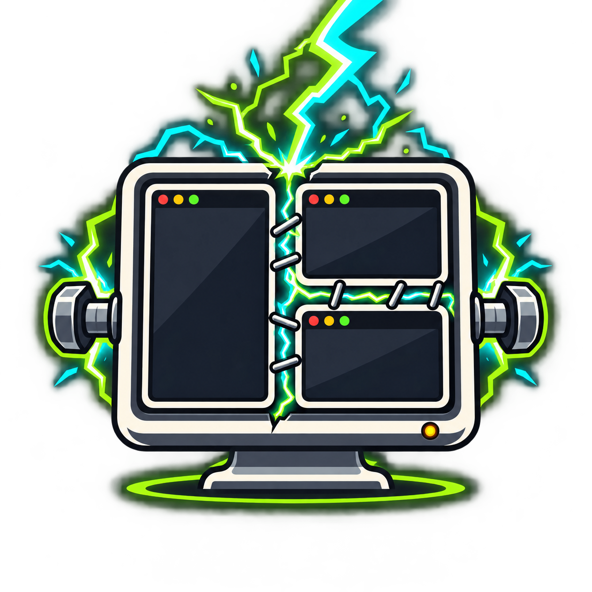

# Reanimate

<p align="center">
  
</p>

**Your Hyprland session dies every time you reboot. Reanimate digs it back up.**

Not a shambling approximation with the right apps somewhere in the general
vicinity. The same windows, on the same workspaces, in the same splits, at the
same ratios, with your terminals still in the directories you left them in.

```
        before it died                   after it got back up
    ┌──────────┬──────────┐             ┌──────────┬──────────┐
    │          │  chrome  │             │          │  chrome  │
    │   foot   ├──────────┤     -->     │   foot   ├──────────┤
    │          │  editor  │             │          │  editor  │
    └──────────┴──────────┘             └──────────┴──────────┘
```

## What claws its way back

- **The tiling tree**: split structure, orientation and ratios, not merely
  which workspace things landed on
- Every window's launch command, exhumed from `/proc/<pid>/cmdline`
- Terminal working directories: the shell's *real* cwd, not wherever the
  terminal was first opened
- Floating windows at their exact position and size; fullscreen, maximized and
  pinned states
- **Every browser window with its actual tabs**, each on its own workspace
- Web apps, relaunched individually instead of collapsed into one window
- [herdr](https://herdr.dev) sessions, and the AI agents living in its panes
- Which workspace was active on each monitor, and which window had focus

Most session tools stop at "right app, roughly the right place", because
Hyprland exposes no way to read or write its layout tree. Reanimate
reconstructs the tree from the saved window rectangles and replays it one
window at a time. Verified pixel-identical on layouts up to six windows with
deeply nested and heavily skewed splits.

## Install

```bash
omarchy plugin add https://github.com/scottharvey/omarchy-reanimate.git --enable
~/.config/omarchy/plugins/io.github.scottharvey.reanimate/install.sh
```

Both lines matter. `omarchy plugin add` does **not** run `install.sh`, so on
its own it gives you the Quickshell service and nothing else: no periodic
snapshots, no menu entries. From a clone, just `./install.sh`.

The installer adds a post-boot hook and a systemd user timer that snapshots
every 2 minutes.

Then, recommended: merge `extensions/omarchy-menu-snippet.jsonc` into
`~/.config/omarchy/extensions/omarchy-menu.jsonc` and run `omarchy menu
refresh`, so Reboot and Shutdown take a fresh snapshot on the way down, and
ask your browser to die politely. That is the difference between it coming
back with your tabs and coming back with a blank New Tab. Merging the snippet
edits your menu config, so it is deliberately left to you.

## Install prompt

Hand this to a coding agent and it will do all of it, including the menu step:

```text
Install the Reanimate plugin on this Omarchy machine:

1. omarchy plugin add https://github.com/scottharvey/omarchy-reanimate.git --enable
2. Run install.sh from the installed plugin directory. `omarchy plugin add` does
   not run it, and without it there is no snapshot timer and no boot hook.
3. Merge extensions/omarchy-menu-snippet.jsonc into
   ~/.config/omarchy/extensions/omarchy-menu.jsonc, keeping any entries already
   there and backing the file up first, then run: omarchy menu refresh
4. Verify: omarchy-reanimate-save reports the windows it saved, and
   `systemctl --user is-active omarchy-reanimate-save.timer` prints active.
```

## Remove

Putting it back in the ground:

```bash
systemctl --user disable --now omarchy-reanimate-save.timer
rm -f ~/.config/systemd/user/omarchy-reanimate-save.{service,timer}
rm -f ~/.config/omarchy/hooks/post-boot.d/11-reanimate
rm -f ~/.local/bin/omarchy-reanimate-{save,restore,show,diff}
omarchy plugin remove io.github.scottharvey.reanimate
```

Then drop the `system.reanimate-save`, `system.reboot` and `system.shutdown`
entries from `~/.config/omarchy/extensions/omarchy-menu.jsonc` if you added
them, and run `omarchy menu refresh`. The remains are in
`~/.local/state/omarchy/reanimate/` and can be deleted too.

## Commands

All four land in `~/.local/bin`, so they are on your PATH.

```bash
omarchy-reanimate-save                # snapshot now
omarchy-reanimate-show                # readable view of what is buried
omarchy-reanimate-restore --dry-run   # what a restore would do, without doing it
omarchy-reanimate-diff                # did it come back right?
```

`omarchy-reanimate-diff` exits non-zero on anything less than a perfect
restore, so you can gate a test script on it.

## What stays dead

This is best-effort relaunch, not necromancy. Processes are not frozen and
resumed. Only hibernation (`omarchy hibernation setup`) does that.

- **Apps reopen fresh.** Unsaved work is gone. Editors and browsers bring back
  their own state only if they are configured to.
- **Terminals come back in the right directory with a fresh shell**, not your
  running program. Use a multiplexer if you need the session itself.
- Window **groups** are recorded but not rebuilt. Grouped windows sit out of
  the layout reconstruction so they cannot corrupt the rest of the tree.
- Only the `dwindle` layout gets tree reconstruction. Under anything else,
  windows still reach the right workspaces with correct floating geometry.
- Scratchpad and special workspaces are skipped.
- The restore visits each workspace as it rebuilds it, then returns you to the
  one you were on. It is visible on boot, and it is what makes the insertion
  order exact.
- Rebooting outside the menu (a bare `systemctl reboot`) gets you whatever the
  last automatic snapshot saw, up to ~2 minutes stale.

## Requirements

Omarchy with Hyprland 0.56+ (the restore drives the Lua dispatcher API) and
Python 3.11+, standard library only. No sudo, no network, no third-party
packages.

Optional: [herdr](https://herdr.dev). If it is running, its window is
relaunched and the agents in its panes are restarted. Nothing here needs it.

Tested on Omarchy 4.0.1, Hyprland 0.56.2, `dwindle`, `foot` and Chromium. The
terminal entries for kitty, Alacritty, ghostty and wezterm follow each
terminal's documented flags but have not been exercised; other browsers are
untested.

## Digging deeper

- [How it works](docs/how-it-works.md): layout tree reconstruction, browser
  handling, how a terminal's contents are found, when the restore fires
- [Configuration](docs/configuration.md): every option, and the state files
- [Troubleshooting](docs/troubleshooting.md): the diff tool, reading the log,
  testing without rebooting

## License

MIT. See [LICENSE](LICENSE).
